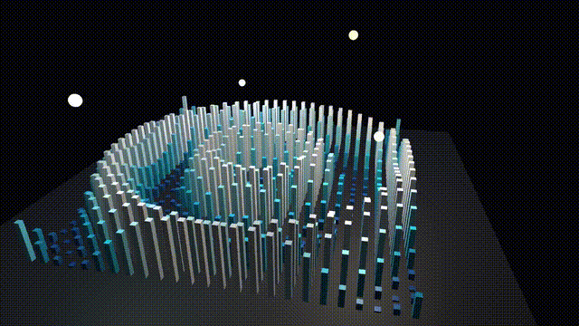

# 3D Kinetic Sculpture

A real-time 3D kinetic sculpture inspired by the [BMW Museum Kinetic Installation](https://www.youtube.com/watch?v=3iEoEgC9jvM). A 25×25 grid of metallic pillars oscillates vertically, driven by layered sine-wave patterns, illuminated by orbiting point lights with Blinn-Phong shading.

Built with C++ and OpenGL 3.3.

## Demo


<video src="https://github.com/user-attachments/assets/f5b545ee-6f1c-4cef-be71-71eed2be1e6f" controls autoplay loop muted width="100%"></video>

## Features

- **625 animated pillars** on a 25×25 grid, each independently driven by mathematical wave functions
- **6 wave patterns** — switchable in real-time:
  1. Concentric Ripple
  2. Diagonal Wave
  3. Double Spiral
  4. Cross Wave
  5. Breathing Pulse
  6. Layered Chaos
- **Dynamic lighting** — 4 coloured point lights orbit the sculpture, plus a directional fill light
- **Height-mapped colour gradient** — pillars shift from deep blue → cyan → white based on elevation
- **Blinn-Phong shading** with per-fragment normals, specular highlights, and a subtle rim light
- **Free-fly camera** — full WASD + mouse orbit control
- **Procedural geometry** — all meshes (cubes, plane, spheres) are generated at runtime; no external assets required

## Controls

| Key | Action |
|-----|--------|
| `W` `A` `S` `D` | Move camera |
| `Mouse` | Look around |
| `Scroll` | Zoom in / out |
| `1` – `6` | Switch wave pattern |
| `Space` | Pause / resume animation |
| `+` / `-` | Speed up / slow down |
| `R` | Reset camera |
| `ESC` | Quit |

## Tech Stack

| Component | Library |
|-----------|---------|
| Graphics API | OpenGL 3.3 Core via **GLAD** |
| Windowing | **GLFW 3** |
| Math | **GLM** |
| Shader management | LearnOpenGL `Shader` class |
| Camera | LearnOpenGL `Camera` class |
| Build system | **CMake 3.10+** / Visual Studio 2022 |

## Project Structure

```
gen3dart/
├── src/
│   ├── kinetic_sculpture/
│   │   ├── kinetic_sculpture.cpp   # main application
│   │   ├── kinetic_pillar.vs       # pillar vertex shader
│   │   ├── kinetic_pillar.fs       # pillar fragment shader (Blinn-Phong)
│   │   ├── kinetic_light.vs        # light orb vertex shader
│   │   └── kinetic_light.fs        # light orb fragment shader (emissive)
│   ├── glad.c                      # OpenGL loader
│   └── stb_image.cpp               # image loading (stb wrapper)
├── includes/                       # third-party headers (GLAD, GLFW, GLM, etc.)
├── lib/                            # pre-compiled libraries (glfw3.lib, etc.)
├── configuration/
│   └── root_directory.h.in         # CMake path template
├── CMakeLists.txt
├── build.ps1                       # one-click build script
└── README.md
```

## Build

### Prerequisites

- **Windows 10/11**
- **CMake 3.10+**
- **Visual Studio 2022** with the _Desktop development with C++_ workload

### Steps

```powershell
# If CMake is not in PATH, set it:
$env:CMAKE_PATH = "C:\Program Files\CMake\bin\cmake.exe"

# Build
.\build.ps1
```

### Run

```powershell
cd bin
.\kinetic_sculpture.exe
```

## Shaders

### Pillar shaders (`kinetic_pillar.vs` / `kinetic_pillar.fs`)

The vertex shader transforms positions and normals into world space. The fragment shader implements:

- **Directional light** — ambient + diffuse + specular fill
- **Multi-point lights** — 4 orbiting coloured lights with distance attenuation
- **Rim lighting** — subtle blue edge glow for depth

### Light shaders (`kinetic_light.vs` / `kinetic_light.fs`)

A minimal pass-through that renders the light orbs as flat emissive spheres.

## Acknowledgements

- [LearnOpenGL](https://learnopengl.com/) by Joey de Vries — framework headers and tutorials
- [BMW Museum Kinetic Sculpture](https://www.youtube.com/watch?v=3iEoEgC9jvM) — visual inspiration